# FoodScore

<p align="center"> 
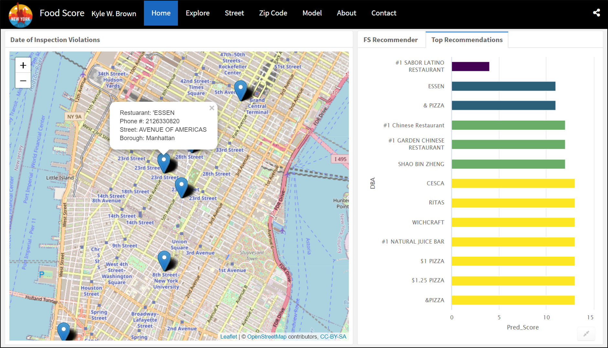 
</p>
 
<p align="justify">
This project initially consisted of a proposal with business objectives, implementing a recommedation system, and delivering a final product in the form of a web application. FoodScore was quickly adopted as a proof of concept with the focus on value creation, food safety, and integrating interactive visualizations.  
</p>

## Overview

- Proposal with dataset accompanied by business objectives concentrating on problem, value statement, and competition. 
- Model building with collaborative filtering using item-based and user-based recommender algorithms. 
- Interactive visualizations with maps, barcharts, time series, piechart, and treemap.  
- Deliver final product through interactive web application. 

## Website: [rpubs.com/kylewbrown/FoodScore](https://rpubs.com/kylewbrown/foodscore)

<br>

# Table of Contents

- **[Proposal](#proposal)**
     - Data
- **[Business Objectives](#business-objectives)** 
     - Problem
     - Value Statement 
     - End-User
     - Competition
     - Deliverables 
- **[Visualization](#visualization)**
     - Bar charts
     - Maps
     - Time Series
     - Treemaps
- **[Model](#model)**
     - `recommenderlab`  
     - Collaborative Filtering (CF)
     - Item-Based Collaborative Filtering (IBCF)
     - User-Based Collaborative Filtering (UBCF) 
     - CF Summary   
     - Results        
- **[Checkpoint Presentation Videos](#checkpoints)**
     - Checkpoint 1 Video
     - Checkpoint 2 Video
     - Checkpoint 3 Video
- **[FoodScore Screenshots](#foodscore-screenshots)**
     - Home 
     - Explore 
     - Model
     - About
     - Contact
<br>

# **Proposal** 

> ***To reduce foodborne illness outbreaks and food poisioning deaths by creating awareness of restuarant inspection violation updates.***

## Data
- **NYC Open Portal**
     - [DOHMH Restuarant Violation Dataset](https://data.cityofnewyork.us/Health/DOHMH-New-York-City-Restaurant-Inspection-Results/43nn-pn8j): Inspection violations posted daily.

<br>

# Business Objectives

## Problem

<p align="center"> 
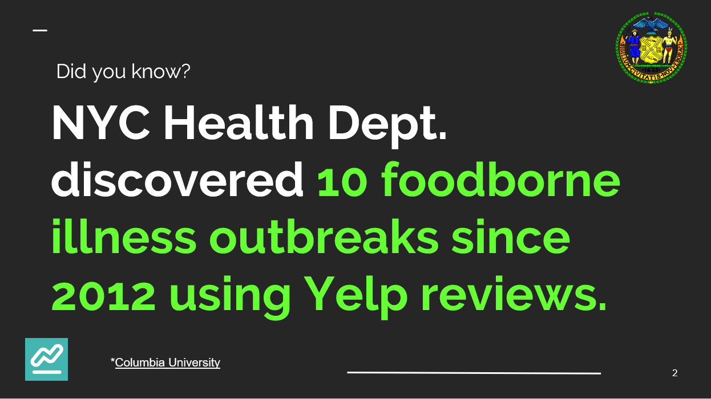 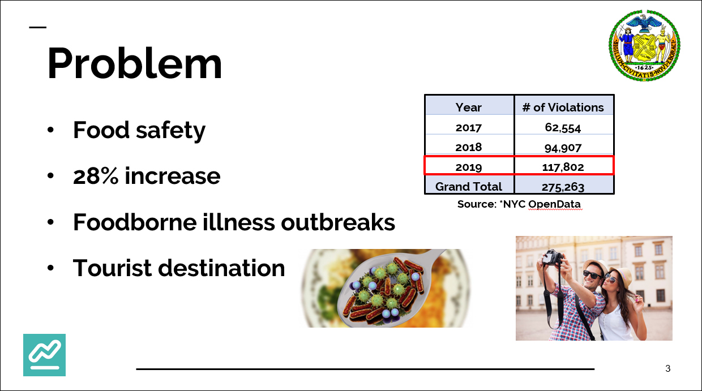
</p>

<p align="justify">
To put foodborne illness outbreaks into perspective, and why it’s a problem. Food safety is a concern in NYC as the number of violations have significantly risen by an average of 28% over the past 3 years. Across the USA there are 3,000 deaths a years due to food poisoning and foodborne illness outbreaks are common in NYC. New York City has one of the highest concentration of restaurants in the world with around 27,000 and tourist revenue account for $44 billion in 2017. 
</p>

    
## **Value Statement**

<p align="center"> 
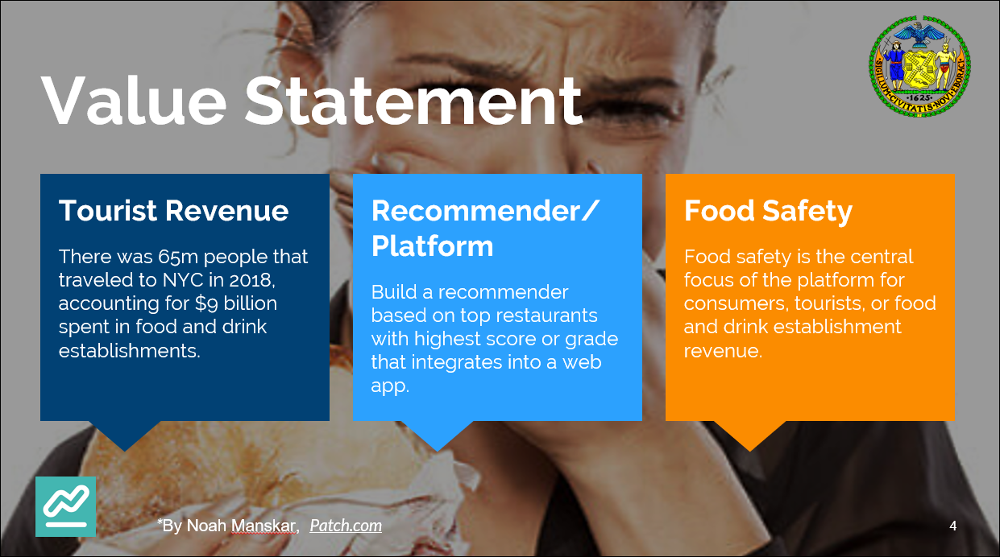 
</p>

### Driving value through tourist revenue and clean establishments

<p align="justify">
     
- **Value Proposition**
     - Increasing tourist spending in restaurants by 1% would account for $90 million in revenue.
     - Americans spend an average of $33 per day on food when on a domestic vacation, about 80% of which is spent in restaurants ([Value Penguin](https://www.valuepenguin.com/average-cost-vacation)) 
</p>

## End-Users

<p align="center"> 
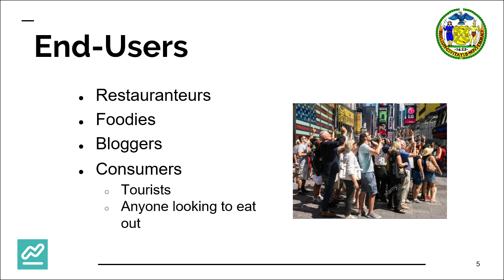
</p>

<p align="justify">
     
- The end users for FoodScore would be restauranteurs, foodies, bloggers, or general consumers. 
- A consumer would be anyone looking to grab a clean bite to eat close to work, their hotel, shopping, or most importantly close to Broadway (most violations & 23% more violations than 3rd Avenue). 
</p>

## Competition

<p align="center"> 
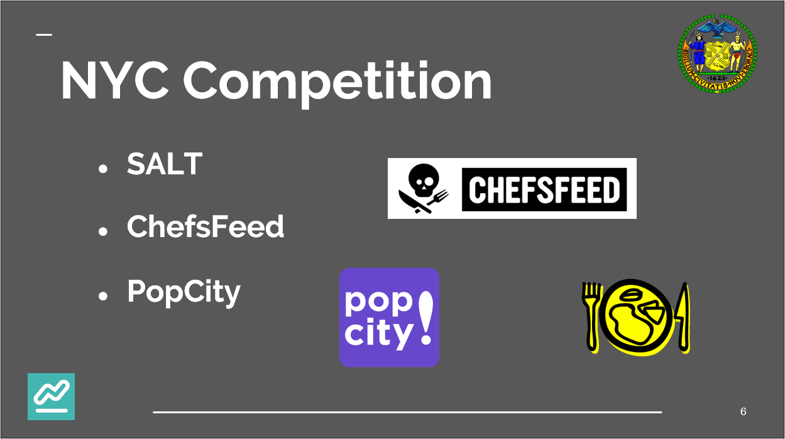
</p>

<p align="justify">

- SALT lets you view a restaurant’s menu, make a reservation through OpenTable when applicable, and even allows you to request an Uber to any of your saved locations. 

- ChefsFeed capitalizes on the credibility and clout of leading professional chefs to help New Yorkers discover new spots in a social media-type network. 

- PopCity allows users to map any food photos they find on social media outlets like Instagram or on the Popcity discovery channel. Using Instagram’s photo copy link feature, you can immediately import a post to your Popcity map. 
</p>

## Deliverables
- **Final Deliverables**
    - Checkpoint presentations
    - Website : https://rpubs.com/kylewbrown/FoodScore/
    
<br>

# **Visualization**
- **Interactive Visualizations**
     - Treemap of violations by cuisine type 
     - Choropleth map of violations to zip code  
     - Bar charts of DBA violations
     - Time Series plot of violation dates

<p align="center"> 
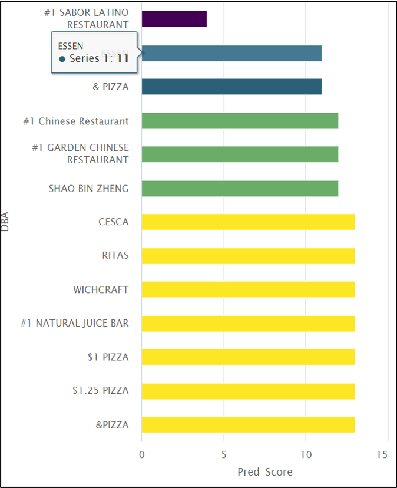 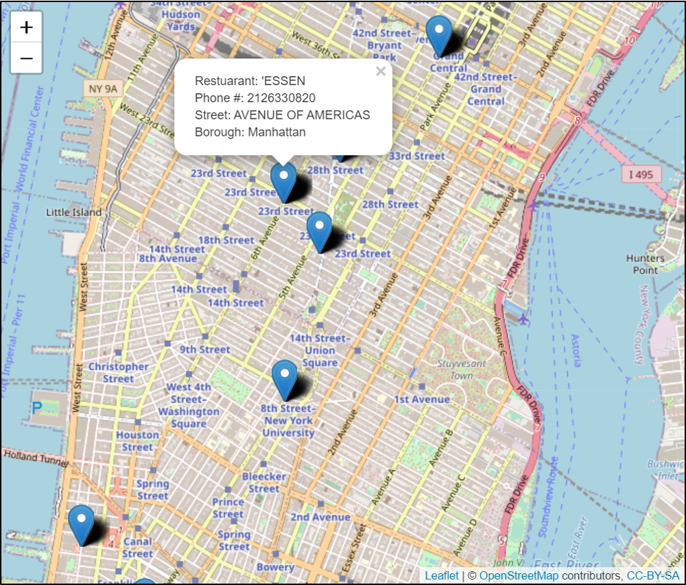 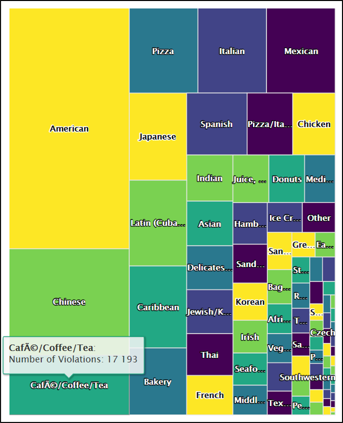
</p>

<br>

# **Model**

## `recommenderlab`

<p align="justify">
     
- In `recommenderab` concentration is placed on the second category of recommender algorithms called collaborative filtering. 

## Collaborative Filtering

-  **Collaborative filtering (CF)**
     - Uses given rating data by many users for multiple items as the basis for predicting missing ratings and/or for creating a top-N recommendation list for a given user, called the active user.

- **User-Based Collaborative Filtering (UBCF)**
     - User-based CF is a memory-based algorithm which tries to mimics word-of-mouth by analyzing rating data from many individuals. 
     - The assumption is that users with similar preferences will rate items similarly. Thus missing ratings for a user can be predicted by first finding a neighborhood of similar users and then aggregate the ratings of these users to form a prediction. 
     - The neighborhood is defined in terms of similarity between users, either by taking a given number of most similar users (k nearest neighbors) or all users within a given similarity threshold. 
     
- **Item-Based Collaborative Filtering (IBCF)**
     - Item-based CF is a model-based approach which produces recommendations based on the relationship between items inferred from the rating matrix. 
     - The assumption behind this approach is that users will prefer items that are similar to other items they like.
     - The model-building step consists of calculating a similarity matrix containing all item-to-item similarities using a given similarity measure.

- **CF Summary**
     - The IBCF recommender method type is transformed into a sparse matrix object using the POPULAR method with the first 100 data points to issue three (TopN = 5) recommendations for a new DBA. 
     - In UBCF the procedure is to first find other users that are similar to a given user, then find the top-rated items violations by those users. Those items are then recommended for the given user.
     
- **Results**
     - The IBCF model recommender predicted `ESSEN with an RMSE=2.642, MSE = 6.978, and MAE = 2.180.
     - The observed UBCF recommender of `ESSEN predicted at RMSE = 1.986, MSE = 3.945, MAE = 1.511, with 118 KITCHEN performing RMSE = 1.057, MSE = 1.116, MAE = 0.871.
</p>

<br>

# **Checkpoints**

## Checkpoint 1

<p align="center"> 
   <a  href="https://youtu.be/57SIwoPWfSg">   

</p>
                                                                                                                                                                                                                                                                                                         

## Checkpoint 2

<p align="center"> 
   <a href="https://youtu.be/a1V14WlvNNQ" target="_blank">   
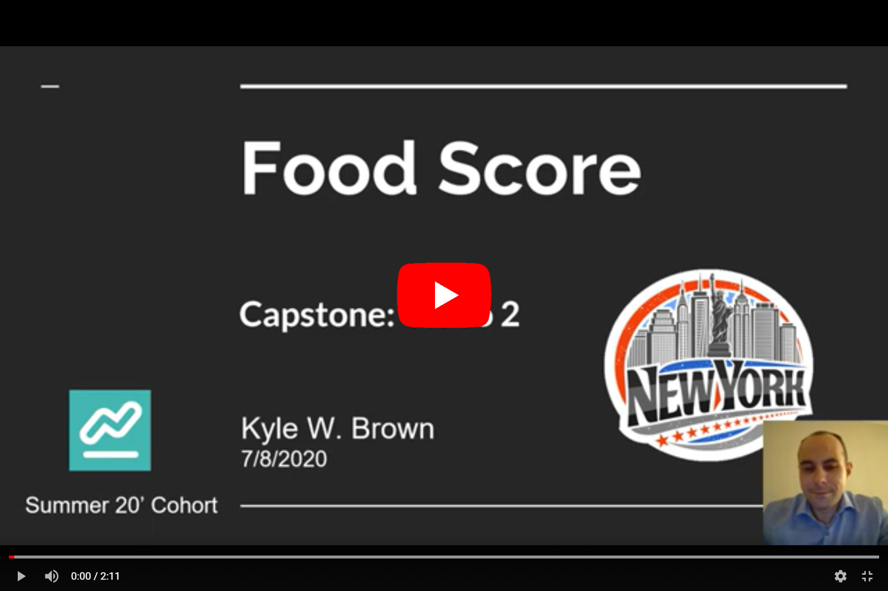
</p>

## Checkpoint 3

<p align="center"> 
   <a href="https://youtu.be/jwJSjUchJ6M" target="_blank">   
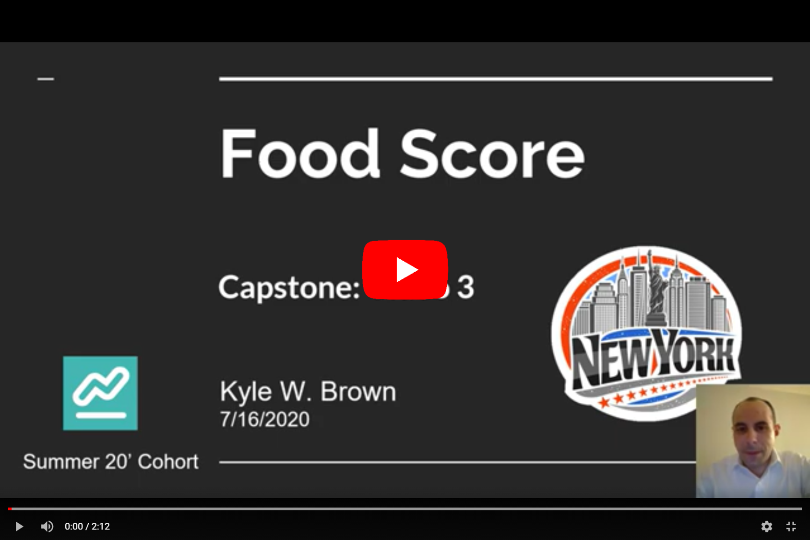
</p>
   
<br>   

# **FoodScore Screenshots**

## Home

<p align="center"> 
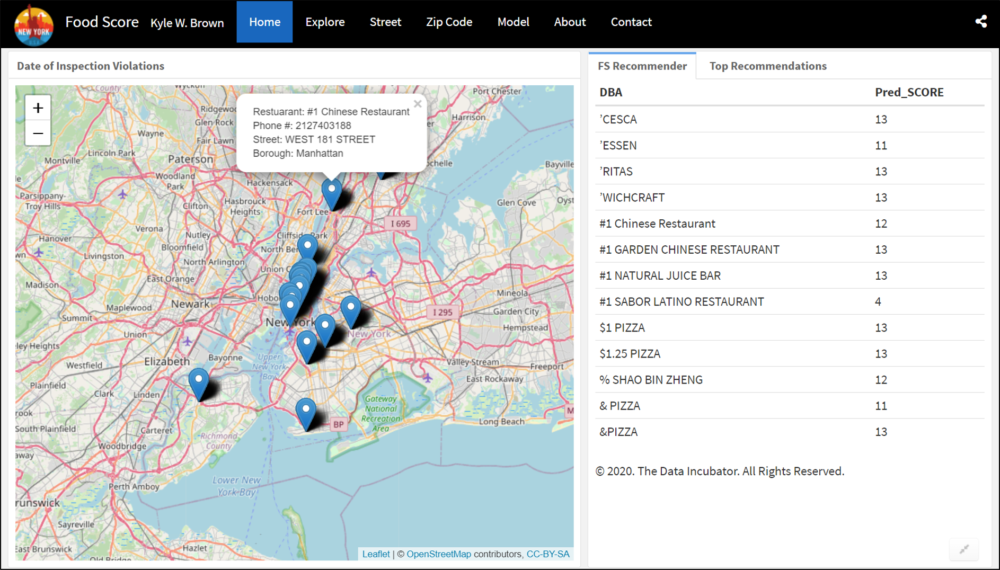
</p>

## Explore

<p align="center"> 
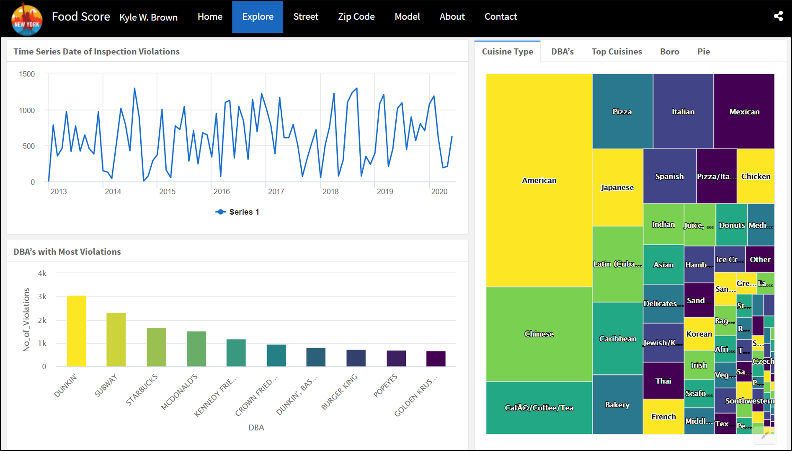
</p>

## Model

<p align="center"> 
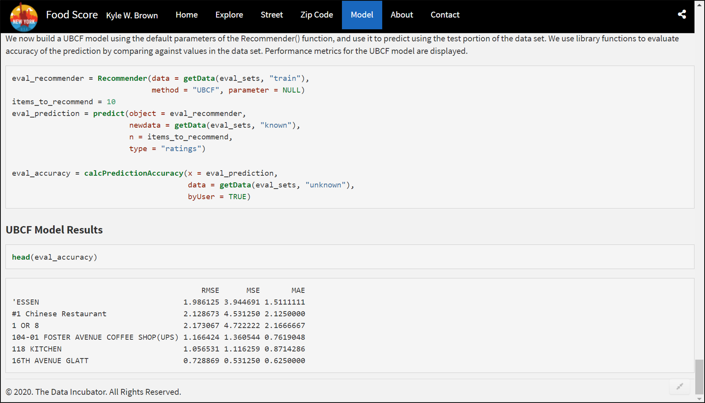
</p>


## About

<p align="center"> 
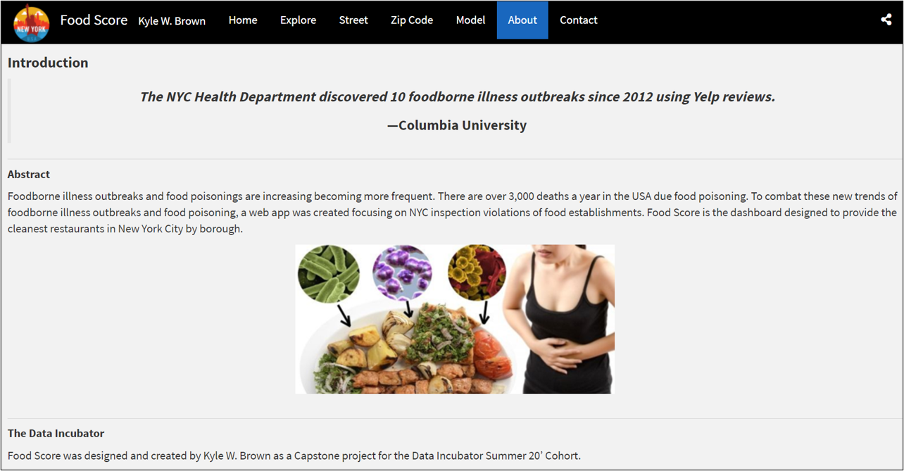
</p>

## Contact

<p align="center"> 
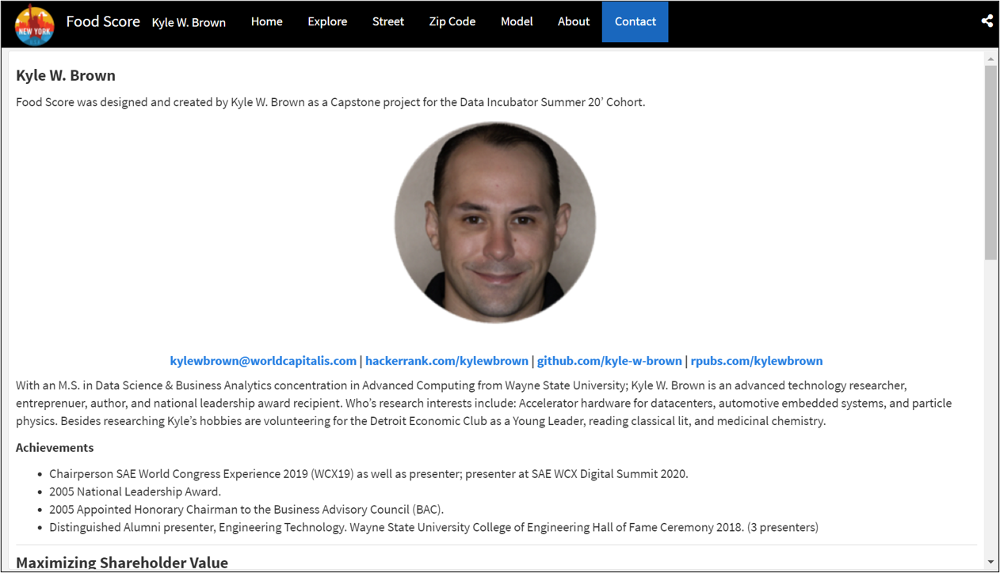
</p>

### Citation

```sh 
@Manual{,
    title = {recommenderlab: Lab for Developing and Testing Recommender Algorithms},
    author = {Michael Hahsler},
    year = {2020},
    note = {R package version 0.2-6},
    url = {https://github.com/mhahsler/recommenderlab},
}
```
